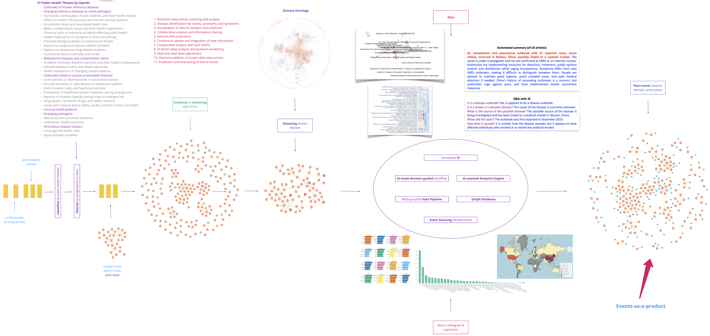
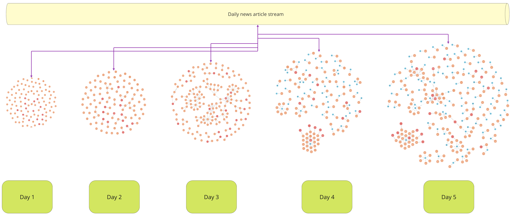
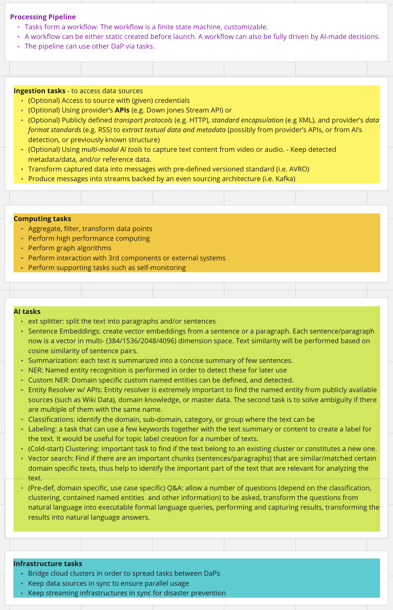
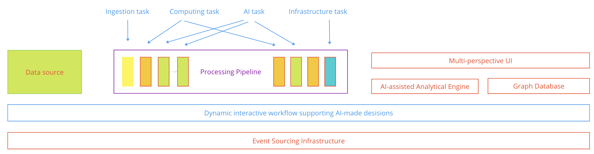
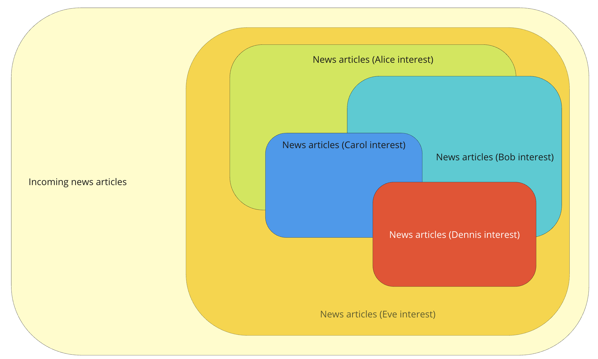
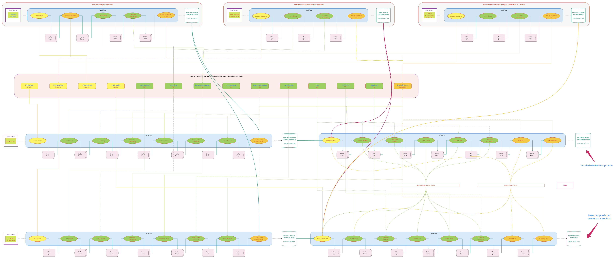
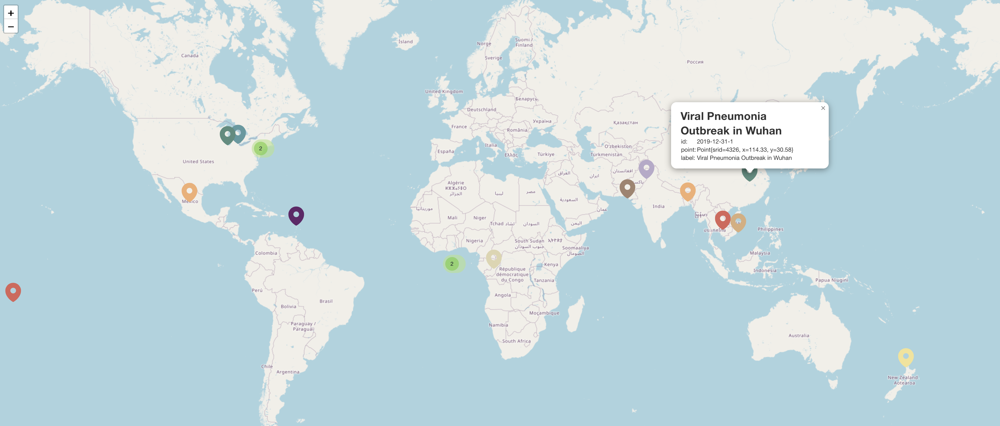
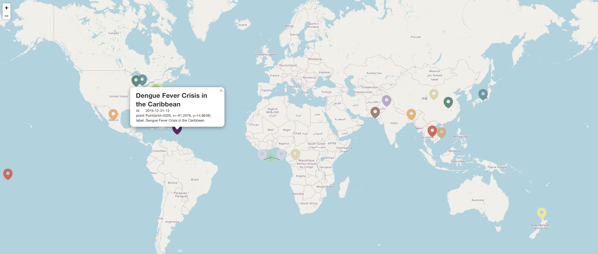
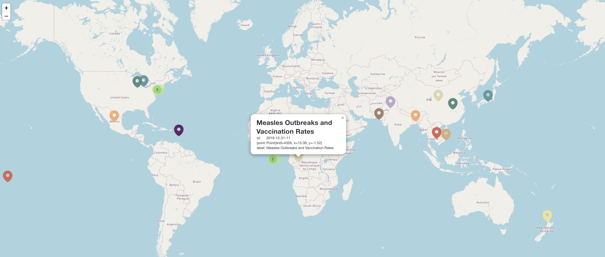

[Back to FORESIGHT](../README.md)

# [The story of Alice](#the-story-of-alice)

&nbsp;

## A. Five objectives

1. **Domain Knowledge by AI for AI**:
    - Developing an automatic detection and analysis system using domain knowledge.
    - Augment capabilities to identify relevant data across various formats such as news articles, documents, and videos for a thorough data collection process.

2. **At-a-Glance Event Detection**:
    - Creating web interfaces to easily visualize extensive data, showing relationships and contexts for clearer understanding.
    - Adjust views to identify different data clusters, select specific items, and conduct detailed analysis with  advanced AI-assisted infrastructure.

3. **AI-assisted Dynamic Interactive Workflow**:
    - Dynamic analysis of information flows to monitor and assess shifts and trends within data to gain insights into their characteristics and potential implications.

4. **Streamlined Data Management**:
    - Automate collection, organization, and analytical processes, applying domain-specific expertise for efficient data interpretation.

5. **Informed Decision-Making**:
    - Generate actionable recommendations by comparing with past decisions, expert insights, and evaluating the links between information sources and the impacted entities.

&nbsp;

## [B. Story of Alice](#b-story-of-alice)

*Alice is an epidemiologist. She is specialized in detecting, analyzing, and informing about **disease outbreaks**.*

*Every day at 9:00 AM, she starts the day by reading news articles that are accumulated over night. News articles continuously arrive in real-time, so as she works through her shift, more and more can come to her screen.*

*The news articles are pre-processed. They are classified by public health threats. Articles are reported by different news agencies/publishers in different languages. Articles with content almost identical or with little variation are considered the same. Articles with great similarity belong to the same cluster. A cluster might contain articles reporting about the same event spreading over a large geographical area over a period of time.*

*Diseases are identified by names , synonyms, and well-known symptoms. Some are unknown. Not all disease outbreaks appear as a cluster at the beginning, but it is likely that they will over a span of days. The higher the intensity, the faster a cluster forms. It is also likely that multiple clusters can be formed separately and then start to merge over time; or they form and show closeness upon visualization.*

*Alice sees all clusters that are specific to her tasks. She analyzes a cluster of articles as a single entity. For each article, type of disease, effects on population, location, and other information are extracted and visualized on the same view, thus helping her to understand the event comprising one or more clusters of articles to a fuller extent.*

*Furthermore, if the event persists for a few days, she can then visualize changes in time and geography. She searches for similar events in the past; if found, she then looks for learned lessons and suggested courses of actions. She can also learn if some predictions made during the past few days were correct or not and what predictions would be made for the near future.*

*If some deeper analysis is required she asks the AI questions and receives answers. She decides if it is worthy of someone else’s attention, to raise the level of alert, or simply to put it on hold if it seems to be contained or isolated. Note that when she is working on some events, cluster-able news articles can arrive and be added to those at anytime. Also note that she and some colleagues may be working on the same set of events and share insights in real-time.*

*At some point she can read the analysis made by her colleagues or read and add some of her own. If an event analysis is considered adequate for consumption, she can gather all available information into an event profile and publish it as her product.*

*By the time she finishes her shift, her events-as-a-products for consumers should be ready (some events might be pending review requiring attention of her colleagues and/or her supervisor).*

## C.How Alice plays in the playground?

### C.1. The basic tasks

*She has a high-level overview of all events assigned to her (automatically or by her colleagues), she selects or groups any subset of those events, she then asks the UI to perform a number of NLP tasks such as:*
- **Classifications**: *which topic, which category, etc the events in this set belong to. She can narrow down to a very specific topic/categories or can obtain multiple categories at the end.*
- **Labeling**: *Provide short label with a few words about set of words, sentences. She can  obtain natural language labels for a dynamically created topic such as “Unknown pneumonia outbreak in Wuhan”.*
- **Summarization**: *she asks and receive a short text about any content or any group of content. For example she can ask to receive a summary of 97 articles in a “Unknown pneumonia outbreak in Wuhan” cluster in 5 or less sentences.*
- **Named Entity Extraction**: *What locations, organizations, etc. What information available about them: Wiki data, available domain knowledge. She asks and receives the situation of Covid during the week December 31, 2019 - January 6, 2020, see it it is spreading from Wuhan to Macao, Hong Kong, and other nearby locations.*
- **Custom Named Entity Extraction**: *by defining custom entities such as air routes and border entires, Alice can tracks the passenger traffic by air from Wuhan or other suspected locations directly to Canada.*

### C.2. AI assistant

- *Using* **Natural Language Query (text-to-Cypher)** and **Vector similarity search**: *Which disease from Disease Ontology having the symptoms best match with the one in context.*
- *Alice then can continue* **a Q&A session with AI**, *all in natural language, in order to understand better the cluster of news - the event itself. All questions and answers are recorded and can be used to automatically complete the event profile.*
- *During the session, supporting functionality are automatically invoked such as* **search in Wiki data, search by Google, or in a database** *that is created from a collection of private information.*
- *An important task that is performed underneath is natural language reasoning with retrieved data and turning them into answers in natural language.*

### C.3. UI with time travel

- **The UI** *would be able to assist her to automatically complete the profile of each event, move them into real-time dashboard, prepare, and deliver them as event-as-product for consumers. By the time she finishes with the analysis, her product for consumers should be ready (as well as pending events that require her colleagues and/or supervisors to attend to).*

## D. Processing data pipelines

### D.1. Pipelines

### D.2. Data-as-a-product system architecture

## E. Data-as-a-product

Consuming data-as-products to produce events-as-products.

**AI-assisted analytical platform**:
- AI-assisted UI allow users via:
    - Workspace:
        - To see millions of data points, multi-perspective from high-level overview to all properties and relations of a single data point. 
        - To work with a number of data points as a single entity.
        - To interactively ask questions and receive answers in natural language.
        - To explore, analyze, share insights, build, and report profile of events
        - Bring in domain knowledge, master data, private information and so on at any time for better detection and analysis.
    - Real-time dashboard: executive, daily, plus past days, by topic, by event clusters, by geography
    - Work session are recorded as defined. Relevant items are bookmarked. Opinion-required events are automatically shared. Insights are up-to-date in real-time. Produced events become immediately available for consumption.
- An event sourcing architecture that seamlessly create, deliver, and synchronize data points across all users
- An analytical engine that is essentially multi-workflow processing pipeline with on-demand AI/NLP tasks
- A myriad of DaPs from domain knowledge, master data, private information and so on
- A self-monitoring platform that (i) increase or decrease system resources based on workload; (ii) keep data in sync with standby for disaster prevention; (iii) keep track of user sessions and data in motion according to governance policy.

There are many different sources where from data are captured, then delivered to, used, enhanced, and consumed in the FP. They come in at different frequencies, through many different protocols, in many formats, aggregate by various means, and being governed by different policies.

In principle the process consists of:
    
    (i) a data source where the data is captured (it can be a URL with access credentials, an CSV file, or a SQL database, etc), equipped with a ingestion pipeline that contains an adapter of sort to access, transform, and deliver data points in a stream to

    (ii) an on-demand, customizable workflow of tasks forming a processing pipeline, then

    (iii) a platform to serve the processed/created data points (it would be a SQL-/graph database, a web service with APIs, but more likely a Kafka stream of AVRO messages).

Each data source is accompanied with a set of software tools, configurations, automated tests, deployment scripts, and injection of credentials should be able to be independently developed (both locally and on the cloud), tested (both locally and on the cloud), and deployed (directly on the cloud). This is *the self-serve platform, which helps to turn a data source into a Data-as-a-Product (DaP)* in Data Mesh principle.

This way any data source can be plugged into any pipeline or platform, being used by another DaP. It is important to note that each entity (item/product) should have a universally unique identifier (UUID), e.g. a news article, a clinic in BC, a disease. Access to configure, monitor, and use of data sources must be governed by a separate governance plane. Logically a DaP is a separate entity, physically they can share underlaying components such as on-demand tasks in a processing pipeline or a common event sourcing (streaming) infrastructure.

### E.1. News Articles

There are likely two types of news sources: accessible with or without credentials, in order words paid subscriptions or publicly freely available. There is another question regarding republication of full text with or without commercial value. 

*Paid subscriptions*: Daily/real-time news articles each can be a full text article, a video or an audio content, or only a link to a webpage (that would have the full content but would have certain policy related to usage) which can have text, audio, or video content. Note that these articles can be revised in time, updated, deleted, or new articles created in different languages.

It is important to consider identical (by 95% of content, even in different languages, by different publishers), part of 85% of one is another, or similar (85%-95% of key paragraphs), etc.

*Freely subscriptions* (**not implemented now**):
- (Video) Youtube channels 
- (Audio) Podcasts
- (Text) RSS feeds

*(manually collected) Freely accessible* (**not implemented now**):
    - (Text/Video/Audio) web pages (URLs)

*Ingestion Pipeline*:
- (Optional) Access to source with (given) credentials
- (Optional) Using provider’s APIs or (Optional) publicly defined transport protocols (e.g. HTTP), standard encapsulation (e.g XML), and provider’s data format standards (e.g. RSS) to extract metadata (possibly from provider’s APIs, or from AI’s detection, or previously known structure) and textual data
- (Optional) Using multi-modal AI tools to capture text content from video or audio. Keep detected metadata/data, and/or reference data.
- Transform captured data into messages with pre-defined versioned standard (i.e. AVRO)
- Produce messages into streams backed by an even sourcing architecture (i.e. Kafka)

*Processing Pipeline*:
The articles then run through a processing pipeline using some domain knowledge (such as disease ontology), master data (such as geo-locations), private information (such as Canada points of entry by air routes) to prepare events for users via an interactive analytics pipeline.

### E.2. Domain knowledge

*An ontology is an explicit specification of a conceptualization.*

*Machine-readable (MR)*: data is well-formed (syntactically correct) by some data standards (e.g. FHIR R4) with proper encapsulation/serialization format (e.g AVRO) thus can automatically be read by any software that uses the corresponding standards. 

*Machine-executable (ME)*: machine-readable data containing (i) semantics that is essentially defining the structure of knowledge for various domains, and (ii) instructions that governs the semantics.

Domain knowledge (of the Public Health domain) is mostly public or semi-public ontologies or taxonomies:
- Publicly available, in ME formats such as OWL (Web Ontology Language), e.g. Disease Ontology, SNOMED CT
- Publicly available, in MR formats such as FHIR, OMOP

*Some domain knowledge, if not readily available, can be built from (semi-) publicly or  privately available of standards or other formats (HTML, CSV, Excel, Word, PDF).*

*Process:*
- Ingestion Pipeline: 
    - Automatically extract data from sources according to MR/ME standards
- Processing Pipeline:
    - If ME, then transforms it into a new or updates an existing knowledge graph (KG)
    - If MR, then (if needed) add custom constraints/instructions, then transforms it into KG
    - If other formats, then constructs an ontology by:
        - Running through a custom NLP pipeline with additional (if required) KGs to extract entities
        - Perform graph algorithms to detect structures and relations
        - Build an ontology (KG) for extracted entities with understanding of their structures and relations
    - Publish a new/updated data-as-a-product

### E.3. Master data

*Master data represents data about the domain entities that provide context for domain operations.*

*Publicly available as small and updated infrequently dataset*, for example:
- Primary care providers in Canada: hospitals, clinics, etc
- Geonames: all countries, administrative geo-entities (capitals), cities, towns, etc with names, populations, coordinates.
- Canada Post postal codes and boundaries
- PT (public) health regions with boundaries

*Publicly available as online sources*, for example:
- Canada transportation maps by OpenStreetMap
- Wikidata for look up named entities such as building, organization, etc

*Semi-publicly available sources*, for example:
- Vaccine codes, vaccine lot info
- Insurance plan

*Process:*
- For small and infrequently updated datasets:
    - Ingestion pipeline: Data is extracted from online source(s)
    - Processing pipeline: Transformed into a stream of data points
    - Data-as-a-product: Publish a (Neo4j graph) database for ease of access via Natural Language Query (NLQ)
- For large or frequently updated datasets:
    - Providing a real-time resolver accessing online source with custom software, configuration, credentials for each source.
    - Convert request-for-data into real-time query of data from an online source, using cache when possible, capturing response and resolve into entity with UUID.
    - This gateway then constitutes a data-as-a-product.

### E.4. Private/local information

These datasets likely are specific to a single or a group of users. They are not domain knowledge (yet). 

However they are important from the standpoint of processing input data using these as filters to narrow down a set of relevant news articles or adding requirements to the analysis of a set of selected events. 

It is also possible that these are the targets of analysis, meaning that the news archive or incoming news stream is used in order to provide an overall picture or an in-depth analysis.

*Process:*
- As filters: 
    - Ingestion pipeline: Data is extracted from online source(s)
    - Processing pipeline: Transformed into a stream of data points
    - Data-as-a-product: Publish a (Neo4j graph) database for ease of access via Natural Language Query (NLQ)
- As targets: 
    - Data ingested and processed following the same process as above.
    - Pre-defined analytical queries, natural language questions are executed to prepare a dataset ready for consumption or further interactive analysis.
    - Users will consume events as later described with AI-assisted interactive analytics.

### E.5. Health information sources

Stream of data points from primary care, shared by PTs, serve two purposes:
as context for analyzing news articles
as targets for situation analysis, change in time, in comparisons with similar past events.

*Process*:
- As filters: 
    - Ingestion pipeline: Data is extracted from online source(s)
    - Processing pipeline: Transformed into a stream of data points
    - Data-as-a-product: Publish a (Neo4j graph) database for ease of access via Natural Language Query (NLQ)
- As targets: 
    - Data ingested and processed following the same process as above.
    - Pre-defined analytical queries, natural language questions are executed to prepare a dataset ready for consumption or further interactive analysis.
    - Users will consume events as later described with AI-assisted interactive analytics.

### E.6. Events as a product

*Event - such as disease outbreak, natural disaster, industrial accident, etc.*

A detected event represents a cluster of similar news articles, analysis, extracted information, relations to each other, relation to domain knowledge, to master data, to private/local information (used by individuals), to primary care information and so on. Some of the articles are from the current day, while others might be from the past few previous days (or from similar relevant past events).

Events are the result of the FP and likely to be shared, aggregated, extracted, visualized, and delivered for consumption.

### E.7. What else can be considered as a product?

Trained domain ML models as products.

Predictions as products.

Recommendations as products.

### E.8. Alice's data-as-a-products in full view

## [F. Alice - a day of work](#f-alice---a-day-of-work)

In this section, Alice's a day of work of Alice is described. She visits [Foresight Dashboard](http://34.118.173.82:5005).

*Note that the specific day, or rather period (a few days to a week or a month) of choice will be indicated*

### F.1 Situation on December 31, 2019

#### F.1.1. Selecting the dates

Alice starts her day by selecting both `Start date` and `End date` to be `2019-12-31` (the date can be picked, or typed). 

`Threats to be detected - Alice's assignment` is a subset of *9 public health threats* chosen from 31 public health threats previously generated by Open AI (you can change it if you don't want to be Alice, but for understanding the content below, don't):
- *Outbreaks of known infectious diseases*
- *Emerging infectious diseases or novel pathogens*
- *Reports on suspicious disease-related incidents*
- *Foodborne illness outbreaks and recalls*
- *Waterborne diseases and contamination alerts*
- *Outbreaks linked to vaccine-preventable diseases*
- *Unusual health patterns*
- *Emerging pathogens*
- *Anomalous disease clusters*

#### F.1.2. Reviewing the clusters with Alice's assigned detected threats

On this day,
- there were **3749** news articles,
- 2565 articles were clustered into 61 clusters,
- out of 61 clusters, **26** were detected with *public health threats assigned to Alice,* or **0.69%** *of all the articles.*
- there are 1184 (=3749 - 2565) outliers (not in any cluster), and ***293*** of them were detected with *public health threats assigned to Alice,* or ***7..82%*** *of all the articles.*

Alice can see a graph of 26 clusters and their associated threats in the graph titled `Clusters with detected threats`. On the right, in the table titled `Cluster's label and number of articles within Alice's assignment` she can read *AI-assigned short label(s)* of the clusters and the number of articles in each of them. These information helped her to decide which clusters to focus on.

Each of the 26 clusters, for example the `Viral Pneumonia Outbreak in Wuhan` (highlighted in red) containing 147 clustered articles. These are well-related, regardless of the publishers, the publishing languages, or the publishing dates. Instead of reading all 147 articles, Alice can read the analysis of the cluster.

293 outliers are also important, but they are in lower priority of the two reasons:
- further classifications and clustering can be done with them, to reduce the amount of work for each individual articles.
- they would be weak signals of something more important later on, but that will not be decided at this moment.

**Thus, instead of reading 3749 articles, which can easily costs her a month, Alice's work is to concentrating on these 26 clusters and a few outliers later, which can be done in a few hours.**

*She can also be sure that the remaining articles are not within her interests.*

#### F.1.3. Understanding the hierarchical relations among all clusters, clusters with detected threats, and Alice's clusters

- On the *All clusters*, some *non-threats* are shown, these clusters would not be the interest of any public health analysts (for now).
- On the *Only clusters with detected threats* diagram in the middle, some *threats not assigned to Alice* are shown, these clusters are associated with different threats than the ones Alice's assigned to.
- On the *Only Alice's clusters,* *a subtree of disease-related clusters* is show. In practice, there would be many different subtrees with this property, but *each of them contains consistently related disease outbreak clusters*. This would in addition, helps Alice to work better with her cluster.

The differences highlighted as below. 
- On the *All clusters*, some *non-threats* are shown, these clusters would not be the interest of any public health analysts (for now).
- On the *Only clusters with detected threats* (some *threats not assigned to Alice*) are shown, these clusters are associated with different threats than the ones Alice's assigned to.
- On the *Only Alice's clusters,* *a subtree of disease-related clusters* is show. In practice, there would be many different subtrees with this property, but *each of them contains consistently related disease outbreak clusters*. This would in addition, helps Alice to work better with her cluster.

#### F.1.4. Worldmap view of detected clusters

Instead of only seeing the location of each articles, the `World map of clusters with detected threats` view provides a view of recognized locations of the detected clusters.

*Note that some location detection are not correct, for now.*

<table cellspacing="0" cellpadding="0" border="0">
    <tr>
        <td style="text-align: center; vertical-align: top;">
            
            <figcaption>Viral Pneumonia Outbreak in Wuhan</figcaption>
             
        </td>
        <td style="text-align: center;  vertical-align: top;">
            
            <figcaption>Dengue Fever Crisis in the Caribbean</figcaption>
             
        </td>
    </tr>
    <tr>
        <td style="text-align: center;  vertical-align: top;">
            
            <figcaption>Measles epidemic in Samoa</figcaption>
             
        </td>
        <td style="text-align: center;  vertical-align: top;">
            
            <figcaption>Measles Outbreaks and Vaccination Rates</figcaption>
             
        </td>
    </tr>
</table>

The maps can be zoomed, inspected, etc.

#### F.1.5. Undetected clusters

To make sure that no signal gone unnoticed, the `Clusters without detected threats` with both graph view (and highlighted red for matching phrases) and table view are provided.

### F.2 Cluster Analysis

Alice now continues to analyze the 26 clusters the system detected.

#### F.2.1. Selecting an Alice's cluster

The `2019-12-13-1` is chosen (this id can be captured when seeing the clusters in the graph view `Cluster with detected threats` previously, right-click it, then copy the text on the `id` row.)

Paste of type `2091-12-31-1` in the input of the `Cluster by identifier`.

#### F.2.2. Basic information

Several extracted information of the cluster are automatically shown.

**The summary text** is done by (i) first summarize all the representative articles of the clusters then (ii) summarize all the summaries to get *a short and concise summary of the cluster.*

    Twenty-seven cases of viral pneumonia have been confirmed in Wuhan, Hubei Province, China. Seven patients are serious and all are receiving isolation treatment. The Wuhan CDC and Health Committee emphasized that these cases are not related to SARS or atypical pneumonia, with no obvious human-to-human transmission detected. The majority of the patients are merchants from South China Seafood City. Authorities are conducting virus type detection, isolation treatment, and disinfection. The cause and pathogen of the infection are under investigation.

**Keywords** are the ones representing the cluster, make it distinct from other clusters.

    pneumonia, 
    cdc, 
    coronavirus, 
    fever, 
    epidemic, 
    wuhan, 
    outbreak, 
    infection, 
    hospitals, 
    hospital

**Detected threas** are the threats detected using the cluster's summary, based on zero-shot classification technique.

    - Emerging infectious diseases or novel pathogens
    - Outbreaks of known infectious diseases
    - Health implications of changing climate patterns

**Q&A** consisting of 5 pre-defined questions and answers.

|                 **Question**                |              **Answer**              |
|:-------------------------------------------:|:------------------------------------:|
| What disease is mentioned?                  | Viral pneumonia                      |
| What is the possible source of the disease? | South China Seafood City (merchants) |
| How does the disease spread?                | Under investigation                  |
| What geo location does the disease spread?  | Wuhan, Hubei Province, China         |
| Is the disease still spreading?             | Yes                                  |

#### F.2.3. Articles in the cluster

This graph view show all articles that belong to the cluster: 
- The size of a node representing an article depending on the probability that article belongs to the cluster, the higher the larger node.
- The articles highlighted as red if it contains one of the words *Wuhan, pneumonia, coronavirus*
- Each of the articles is connected to an articles whose to it has highest similarity (if there are). *Note that the similarity is asymmetrical.*

The view on the right diagram above is especially helpful for Alice, since it shows the connected component of the graphs that reveals similarity between groups of articles. Thus ***instead of working through 147 articles in this cluster, Alice needs to investigate only a few connected components.***

#### F.2.4. Articles in details

In order to investigate each of the articles in details, Alice can scroll through the list view `Articles`
or *download* (look at the download icon at the lower right of the tab) the csv content of the table if she wishes.

### F.3 Changes in time (for a period of at least 3 days)

#### F.3.1. Preprocessed periods

For a period of 3 days, 7 days, or 30 days, some of them are selected so that it is possible to have a better look how data change in time:

**3 days**: Dec 31 - Jan 02, Jan 01 - Jan 03, Jan 02 - Jan 04, Jan 03 - Jan 05, Jan 04 - Jan 06, Jan 05 - Jan 07, Jan 06 - Jan 08

**7 days**: Dec 31 - Jan 06

**30 days**: Dec 31 - Jan 29

#### F.3.2. December 31, 2019 to January 01, 2020

**Selecting the period**

First, the tasks completed above can be done by selecting a period, for example `Start date` as 2019-12-31, `End date` as 2020-01-02.

Alice now has 60 clusters of interests out of 10783 articles.

The `Pneumonia Outbreak in Wuhan` cluster wit id `2019-12-31-2020-01-02-0` with 358 articles is listed as top on the `Cluster's label and number of articles within Alice's assignment`.

**Selecting the cluster**

She chooses it and types `2019-12-31-2020-01-02-0` in to the `Cluster by identifier`.

**See change in time**

Roll down to the `Change in time` section. 

First, click on the *refresh* (circle button) on the `Start date`, then the `End date` to make sure the dates are correctly entered. Then the `Date - middle diagram` to generate a date.

Click on the *refresh* of the `Articles at the start of the period` and `Articles at the end of the period` to see the full picture of how the connected components of the period are formed during the period.

Below are the connected components formed over time.

Connected components formed with publisher's names shown.

Connected components formed with article's titles shown.

#### F.3.3. December 31, 2019 to January 06, 2020

**See change in time** using hierarchical cluster view.

Below are the connected components formed over time.

### F.4 Chat with AI

*Chat with AI* helps Alice to ask some questions against the cluster.
Three examples are show of what AI used as the context to answer the questions:
- Using the `summary` of the cluster to answer the question (*fastest*)
- Using `the content of the first representative article` of the cluster to answer the question.
- Using `the content of the first three representative articles` of the cluster to answer the question (*slowest*)

Note that *the questions can be changed*, so Alice can ask any question she likes.
In addition, *these questions can be answered automatically when another cluster is chosen!*

### F.5 Outlier analysis

Last but not least, the outliers are analyzed to see if *any of them is a news about a disease outbreak*, which Alice pays attention to.

If it seems to be, then AI attempts to detect a possible disease. The top 10 possible diseases are summed up.

Each of the outliers, of course, can be investigated in details.

[Back to FORESIGHT](../README.md)
